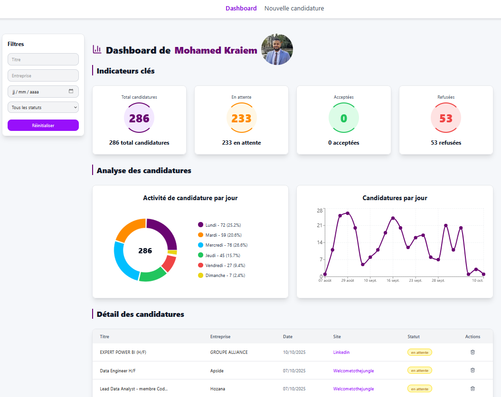

# 🦫 MoleCode ATS

<p align="center">
  <a href="https://nextjs.org/"></a>
  <a href="https://www.typescriptlang.org/"></a>
  <a href="https://tailwindcss.com/"></a>
  <a href="https://fastapi.tiangolo.com/"></a>
  <a href="https://www.prisma.io/"></a>
  <a href="https://clerk.com/"></a>
  <a href="https://render.com/"></a>
  <a href="https://www.python.org/"></a>
</p>


🚀 **MoleCode ATS** (Applicant Tracking System) est une application web personnelle de suivi de candidatures.  
Elle permet de **centraliser**, **analyser** et **automatiser** la gestion de tes candidatures grâce à une interface moderne et un backend de scraping intelligent.

---

## ✨ Fonctionnalités actuelles

- ✅ Tableau de suivi complet (CRUD, filtres, pagination)
- ✅ Authentification sécurisée avec [Clerk](https://clerk.com/)
- ✅ Dashboard interactif avec **statistiques**, **graphiques** et **analyse d’activité**
- ✅ Filtrage par **titre**, **entreprise**, **date** et **statut**
- ✅ Design responsive et moderne (Next.js + Tailwind)
- ✅ Liaison entre utilisateurs et candidatures via `userId`
- ✅ Intégration du scraping backend (FastAPI + Python)

---

## 📊 Aperçu du dashboard

- **Indicateurs clés** : total, en attente, acceptées, refusées
- **Graphiques dynamiques** : donut chart & courbe d’évolution
- **Analyse hebdomadaire** : activité des candidatures par jour
- **Filtres avancés** : recherche par mot-clé, entreprise, date, statut

---

## 🧱 Stack technique

| Élément              | Technologie                                                                                                               |
| -------------------- | ------------------------------------------------------------------------------------------------------------------------- |
| **Frontend**         | [Next.js](https://nextjs.org/) + [TypeScript](https://www.typescriptlang.org/) + [Tailwind CSS](https://tailwindcss.com/) |
| **Backend API**      | [FastAPI](https://fastapi.tiangolo.com/) + [Uvicorn](https://www.uvicorn.org/)                                            |
| **Base de données**  | [Prisma](https://www.prisma.io/) + SQLite                                                                                 |
| **Authentification** | [Clerk](https://clerk.com/)                                                                                               |
| **Déploiement**      | Frontend : Render / Netlify<br>Backend : Render                                                                           |
| **Scraping**         | Python + BeautifulSoup / Requests                                                                                         |
| **Graphiques**       | Recharts + Shadcn UI                                                                                                      |

---

## ⚙️ Configuration d’environnement

### Variables d’environnement

#### Frontend `.env.local`

```bash
NEXT_PUBLIC_API_BASE_URL=https://molecode-ats.onrender.com
NEXT_PUBLIC_CLERK_PUBLISHABLE_KEY=pk_test_...
CLERK_SECRET_KEY=sk_test_...
```

#### Backend `.env`

```bash
PORT=8000
```

---

## 🚀 Déploiement

### Backend (FastAPI)

```bash
uvicorn main:app --host 0.0.0.0 --port $PORT
```

> Déployé sur [Render](https://render.com/) :  
> 🌐 **https://molecode-ats.onrender.com**

### Frontend (Next.js)

```bash
npm run build
npm run start
```

> Déploiement possible sur **Render** ou **Netlify**

---

## 🧩 Modèle Prisma

```prisma
model Post {
  id           Int      @id @default(autoincrement())
  title        String
  society      String
  url          String
  status       String
  creationDate DateTime
  userId       String
}
```

---

## 🔮 Roadmap

- [x] Tableau interactif + filtres + pagination
- [x] Dashboard analytique avec graphiques
- [x] Authentification Clerk
- [x] Backend Python (scraping)
- [x] Intégration automatique des offres via scraping
- [x] Interface mobile optimisée
- [ ] Export des candidatures (CSV / PDF)
- [ ] Automatisation des alertes par e-mail

---

## 👨‍💻 Auteur

**Mohamed Kraiem**  
Projet personnel — _MoleCode ATS_  
💼 Déploiement & backend : [Render](https://render.com)  
🧠 Stack moderne, performante et modulaire.

---

> 📅 Dernière mise à jour : Octobre 2025  
> 🧩 Version : 1.3.2  
> 🧠 Licence : MIT
